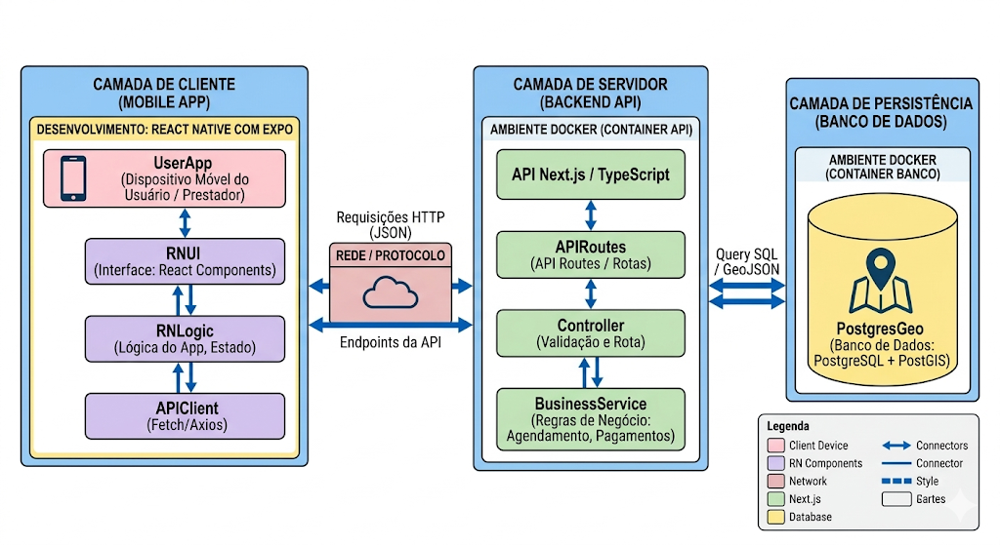

# Arquitetura do sistema:
**Diagrama representando as camadas do sistema (Frontend e Backend):**

# Tabela de tecnologias
| Mecanismo de Análise | Tecnologia de Implementação | Justificativa/Responsabilidade |
|:---|:---|:---|
| **Frontend** | React Native (com Expo) | Permite desenvolvimento nativo para iOS e Android usando uma única base de código (React), acelerando a entrega. O Expo facilita o desenvolvimento e teste. Responsável por toda a interação com o usuário, autenticação do lado do cliente e renderização da UI. |
| **Backend** | TypeScript com Next.js (API Routes) | Next.js fornece uma estrutura robusta para criar uma API REST de forma rápida e segura. TypeScript adiciona tipagem estática, reduzindo bugs e facilitando a manutenção em regras de negócio complexas. Responsável por validar dados, aplicar regras de negócio (RN) e processar pedidos. |
| **Persistência** | PostgreSQL | Banco de dados relacional poderoso e robusto. A extensão PostGIS é fundamental para um sistema "Ifood", pois permite cálculos de geolocalização (encontrar prestadores próximos ao endereço do usuário, calcular distâncias). |
| **Containerização** |  Docker | Utilizado para criar contêineres consistentes para o backend e banco de dados, garantindo que o ambiente de desenvolvimento seja idêntico ao de produção, facilitando o onboarding de novos membros e a implantação. |
