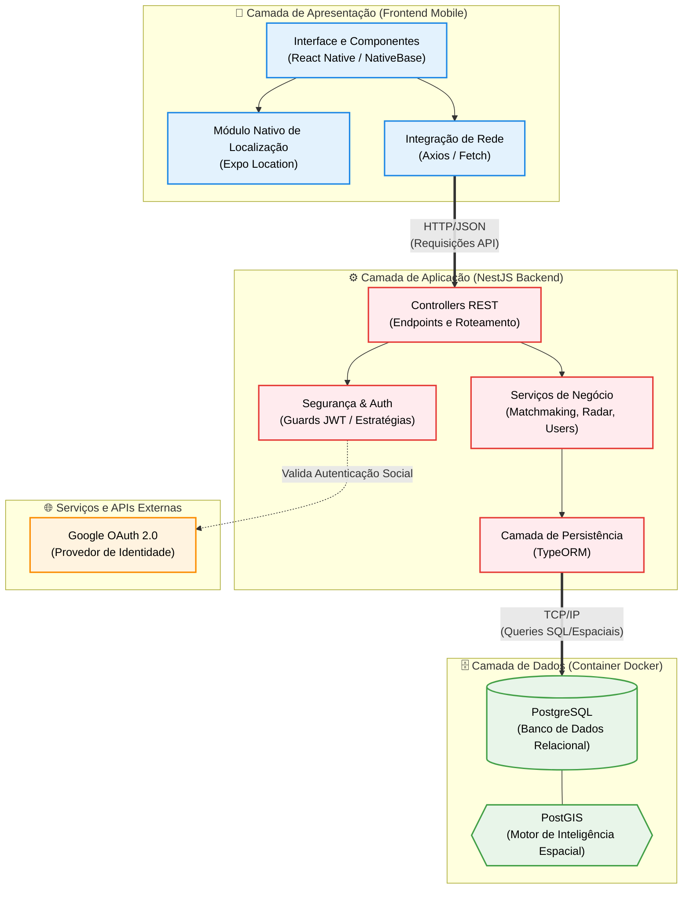

# Documento de Arquitetura do Software

**Projeto:** iService
**Disciplina:** Engenharia de Software II

---

## 1. Visão Geral da Arquitetura

O sistema iService segue uma arquitetura baseada em camadas cliente-servidor, onde o aplicativo móvel (Frontend) atua como cliente consumindo os recursos expostos por uma API RESTful (Backend), que por sua vez gerencia a regra de negócio e a persistência dos dados espaciais e relacionais.

Abaixo, apresentamos o diagrama estrutural detalhado das camadas do sistema, fluxo de dados e serviços externos:

---

## 2. Tabela de Tecnologias

A stack tecnológica foi selecionada visando alta performance em consultas geográficas, tipagem rigorosa para evitar falhas em tempo de execução e facilidade de desenvolvimento mobile cross-platform.

| Mecanismo de Análise | Tecnologia de Implementação | Justificativa/Responsabilidade |
|:---|:---|:---|
| **Frontend** | React Native + Expo | Desenvolvimento multiplataforma (iOS e Android) com base de código única e fácil integração com APIs de sensores nativos (GPS). |
| **Backend** | NestJS (Node.js) + TypeScript | Arquitetura escalável, tipagem estática e segura, e organização modular (Injeção de Dependências) para APIs robustas e de fácil manutenção. |
| **Persistência** | PostgreSQL + extensão PostGIS | Armazenamento relacional sólido combinado com suporte nativo a cálculos e consultas geoespaciais avançadas (ex: busca em raio e cruzamento de coordenadas). |
| **Containerização** | Docker | Padronização do ambiente de desenvolvimento, isolando dependências e evitando problemas de compatibilidade entre os desenvolvedores da equipe. |

---

## 3. Implantação e Infraestrutura Física

O projeto adota uma estratégia de execução conteinerizada para garantir a paridade entre os ambientes de desenvolvimento de todos os membros da equipe.

**Estratégia de Execução Simplificada:**
A implantação e execução local do sistema é orquestrada via **Docker Compose**. O arquivo `docker-compose.yml` declara e conecta os serviços essenciais de forma isolada:

1. **Container de Banco de Dados:** Levanta uma imagem oficial do PostgreSQL já com a extensão PostGIS instalada, mapeando as portas padrão e configurando volumes para que os dados não sejam perdidos ao desligar a máquina.
2. **Container da Aplicação (Opcional p/ Dev):** A API NestJS pode ser executada via Docker ou diretamente no host (`npm run start:dev`) conectando-se ao container do banco de dados exposto.

Essa abordagem elimina a necessidade de configurações complexas de banco de dados na máquina física de cada desenvolvedor, permitindo que o ambiente completo seja instanciado com apenas um comando (`docker-compose up -d`).