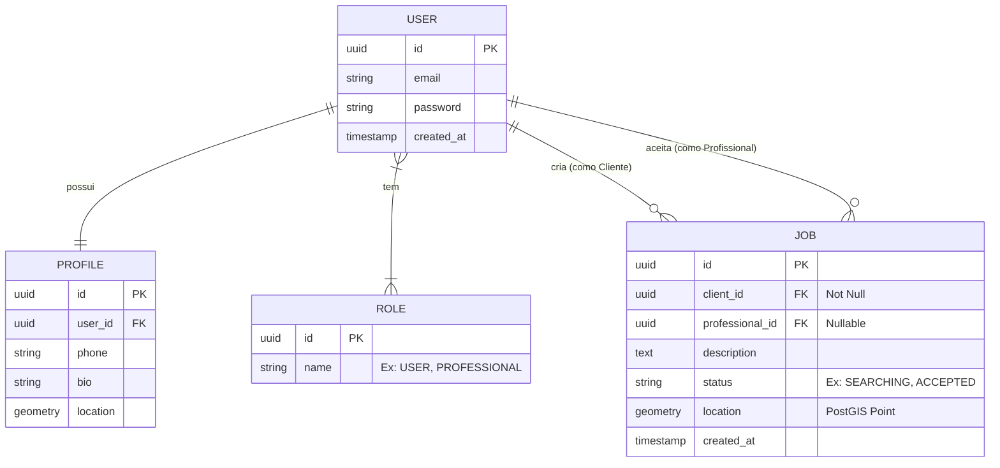

# Documento de Visão

Documento construído a partir do **Modelo BSI - Doc 001 - Documento de Visão** adaptado para o escopo do projeto iService.

## Descrição do Projeto

O **iService** é um aplicativo móvel inserido no contexto da *Gig Economy* (economia sob demanda). Ele funciona como um marketplace geolocalizado em tempo real, focado em conectar pessoas com necessidades urgentes de manutenção, reparos ou serviços rápidos a profissionais qualificados que estejam geograficamente próximos, otimizando o tempo de resposta e reduzindo custos de deslocamento através do uso de inteligência espacial (PostGIS).

## Equipe e Definição de Papéis

Membro                     | Papel                              | E-mail                            |
-------------------------- | ---------------------------------- | --------------------------------- |
Taciano                    | Cliente Professor                  | taciano@bsi.ufrn.br
Kaique                     | Líder Técnico, Desenvolvedor       | kaique.viiera.168@ufrn.edu.com.br
Luiz Henrique              | Desenvolvedor Front-end            | luizhenriquefelix138@gmail.com
Ismael Gomes da Silva      | Desenvolvedor Back-end             | ismaelcraft74@gmail.com
Caio Lucas Lopes           | Analista de Requisitos             | caiolucas0430@gmail.com
Eduardo Nascimento Santos  | Desenvolvedor Front-end e Back-end | eduardoshw123@gmail.com
Isaque Guimaraes           | Desenvolvedor Front-end            | isaqueguimarcar@gmail.com

### Matriz de Competências

Membro                     | Competências                       |
-------------------------- | ---------------------------------- |
Kaique                     | Liderança Técnica, Desenvolvedor Back-end (NestJS, Node.js), TypeORM, PostGIS, GitFlow, Docker |
Luiz Henrique              | Desenvolvedor Mobile, React Native, Expo, NativeBase, Consumo de APIs |
Ismael Gomes da Silva      | Desenvolvedor Back-end, NestJS, Lógica de Negócios, TypeORM, PostgreSQL |
Caio Lucas Lopes           | Engenharia de Software, Levantamento de Requisitos, Documentação, Diagramas (UML/Mermaid) |
Eduardo Nascimento Santos  | Desenvolvimento Full-stack, React Native, NestJS, Integração de Sistemas |
Isaque Guimaraes           | Desenvolvedor Mobile, Interface de Usuário (UI), React Native, NativeBase |

## Perfis dos Usuários

O sistema poderá ser utilizado por diversos usuários. Temos os seguintes perfis/atores autorrelacionados na plataforma:

Perfil                                 | Descrição   |
---------                              | ----------- |
Cliente (USER)                         | O gerador da demanda. É o usuário que relata um problema no aplicativo, compartilhando sua localização inicial (GPS), e aguarda um "match" com um prestador local.
Profissional (PROFESSIONAL)            | O prestador de serviço autônomo. É o usuário que consome o feed do radar em tempo real para visualizar demandas próximas, aceitando os pedidos para otimizar suas rotas.

## Lista de Requisitos Funcionais

### Entidade Usuário - US01 - Manter Usuário
Um usuário representa uma conta de acesso ao sistema. Ele possui um identificador único (UUID), e-mail, senha criptografada e uma data de criação.

Requisito                     | Descrição   | Ator |
---------                     | ----------- | ---------- |
RF01.01 - Inserir Usuário     | Insere novo usuário informando: e-mail e senha. | Cliente, Profissional |
RF01.02 - Login do Usuário    | Autentica o usuário validando as credenciais e retornando um token JWT. | Cliente, Profissional |
RF01.03 - Atualizar Usuário   | Atualiza dados de credenciais da conta. | Cliente, Profissional |
RF01.04 - Deletar Usuário     | Remove a conta do usuário e inativa seus serviços vinculados. | Cliente, Profissional |

---

### Entidade Perfil - US02 - Manter Perfil (Profile/Role)
O perfil contém as informações públicas e a permissão de atuação do usuário no app (Role). Um perfil tem: telefone, biografia e a regra de acesso (USER ou PROFESSIONAL).

Requisito                     | Descrição   | Ator           |
---------                     | ----------- | ----------     |
RF02.01 - Inserir Perfil      | Associa dados complementares (telefone, bio) e a Role principal à conta criada. | Cliente, Profissional |
RF02.02 - Atualizar Perfil    | Atualiza informações de contato e biografia de trabalho. | Cliente, Profissional |
RF02.03 - Alternar Role       | Permite que uma conta transite entre o perfil de Cliente e Profissional. | Cliente, Profissional |

---

### Entidade Serviço (Job) - US03 - Manter Serviço
Um serviço (Job) representa a demanda no marketplace. Ele tem: ID, descrição, status da negociação, localização geográfica (Point) e chaves que o conectam a um cliente e, futuramente, a um profissional.

Requisito                     | Descrição   | Ator           |
---------                     | ----------- | ----------     |
RF03.01 - Solicitar Serviço   | Cria um novo pedido de serviço capturando a descrição e injetando a coordenada (Latitude/Longitude) atual do dispositivo. | Cliente |
RF03.02 - Listar no Radar     | Realiza a varredura e lista serviços com status 'SEARCHING' num raio quilométrico restrito a partir da localização do prestador. | Profissional |
RF03.03 - Aceitar Serviço     | Vincula o ID do profissional logado ao Job, alterando seu status para 'ACCEPTED' (Matchmaking). | Profissional |
RF03.04 - Cancelar Serviço    | Cancela um serviço que ainda não foi concluído. | Cliente, Profissional |

---

### Modelo Conceitual

Abaixo apresentamos o modelo conceitual usando o **Mermaid**.

#### Descrição das Entidades
* **User:** Tabela de autenticação e credenciais base.
* **Profile:** Tabela de extensão contendo dados de contato e a última coordenada conhecida.
* **Role:** Definição de permissões no sistema (autorrelacionamento com User).
* **Job:** Entidade principal contendo o problema relatado e a localização espacial (PostGIS).

## Lista de Requisitos Não-Funcionais

Requisito                                 | Descrição   |
---------                                 | ----------- |
RNF001 - Desempenho Espacial (PostGIS)    | As consultas do radar devem obrigatoriamente usar a função ST_DWithin do PostGIS no banco PostgreSQL para garantir latência mínima em buscas geográficas. |
RNF002 - Segurança de Identidade (JWT)    | Rotas transacionais exigem token JWT. O back-end deve extrair o ID do autor da ação pelo payload do token, sem confiar em IDs de requisição. |
RNF003 - Arquitetura modular e CI/CD      | O código deve seguir a injeção de dependências do NestJS. Pull requests devem passar obrigatoriamente por testes de Lint e Build via GitHub Actions. |
RNF004 - Acesso Nativo a Sensores         | O aplicativo Mobile (React Native/Expo) exige permissões a nível de Sistema Operacional para captura do GPS nativo. |

## Riscos

Tabela com o mapeamento dos riscos do projeto, as possíveis soluções e os responsáveis.

Data       | Risco | Prioridade | Responsável | Status | Providência/Solução |
------     | ------ | ------ | ------ | ------ | ------ |
10/03/2026 | Falha na captura do GPS nativo do celular pelo aplicativo mobile. | Alta | Luiz Henrique e Isaque | Vigente | Implementar fallback via expo-location solicitando permissão ativa e instruindo o usuário. |
10/03/2026 | Lentidão nas consultas de banco devido a cálculos geográficos em massa. | Média | Ismael Gomes | Vigente | Criação obrigatória de índices espaciais (GIST) na coluna de localização da entidade Job no TypeORM. |
10/03/2026 | Quebra da branch principal por código fora do padrão ou com erros. | Alta | Todos | Resolvido | Configurar GitHub Actions (CI) bloqueando o botão de Merge para códigos que não passem no Lint/Prettier. |
10/03/2026 | Usuário fraudar seu "Role" via payload na requisição. | Crítico | Kaique e Eduardo | Vigente | Validação do perfil ser feita estritamente no back-end utilizando NestJS Guards e Decorators customizados. |

### Referências
* Documentação NestJS: [https://docs.nestjs.com/](https://docs.nestjs.com/)
* Manual Oficial PostGIS: [https://postgis.net/documentation/](https://postgis.net/documentation/)
* TypeORM: [https://typeorm.io/](https://typeorm.io/)
* Expo Location API: [https://docs.expo.dev/versions/latest/sdk/location/](https://docs.expo.dev/versions/latest/sdk/location/)