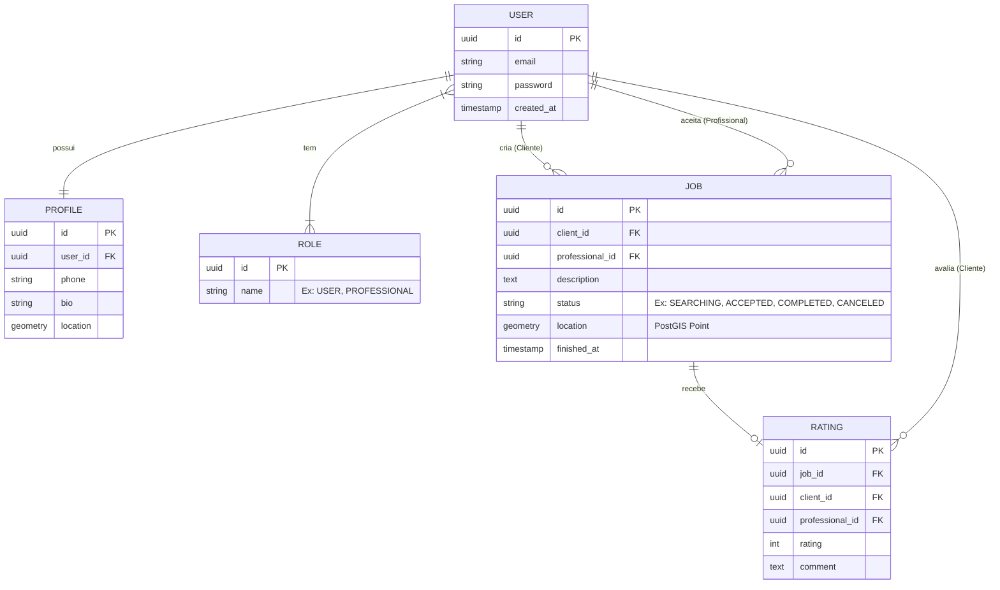

# Documento de Visão

Documento construído a partir do **Modelo BSI - Doc 001 - Documento de Visão** adaptado para o escopo do projeto iService.

## Descrição do Projeto

O **iService** é um aplicativo móvel inserido no contexto da *Gig Economy* (economia sob demanda). Ele funciona como um marketplace geolocalizado em tempo real, focado em conectar pessoas com necessidades urgentes de manutenção, reparos ou serviços rápidos a profissionais qualificados que estejam geograficamente próximos, otimizando o tempo de resposta e reduzindo custos de deslocamento através do uso de inteligência espacial (PostGIS).

## Equipe e Definição de Papéis

Membro                     | Papel                              | E-mail                            |
-------------------------- | ---------------------------------- | --------------------------------- |
Taciano                    | Cliente Professor                  | taciano@bsi.ufrn.br
Kaique                     | Líder Técnico, Desenvolvedor       | kaique.viiera.168@ufrn.edu.com.br
Luiz Henrique              | Desenvolvedor Front-end            | luizhenriquefelix138@gmail.com
Ismael Gomes da Silva      | Desenvolvedor Back-end             | ismaelcraft74@gmail.com
Caio Lucas Lopes           | Analista de Requisitos             | caiolucas0430@gmail.com
Eduardo Nascimento Santos  | Desenvolvedor Full-stack           | eduardoshw123@gmail.com
Isaque Guimaraes           | Desenvolvedor Front-end            | isaqueguimarcar@gmail.com

### Matriz de Competências

Membro                     | Competências                       |
-------------------------- | ---------------------------------- |
Kaique                     | Liderança Técnica, Desenvolvedor Back-end (NestJS, Node.js), TypeORM, PostGIS, GitFlow, Docker |
Luiz Henrique              | Desenvolvedor Mobile, React Native, Expo, NativeBase, Consumo de APIs |
Ismael Gomes da Silva      | Desenvolvedor Back-end, NestJS, Lógica de Negócios, TypeORM, PostgreSQL |
Caio Lucas Lopes           | Engenharia de Software, Levantamento de Requisitos, Documentação, Diagramas (UML/Mermaid) |
Eduardo Nascimento Santos  | Desenvolvimento Full-stack, React Native, NestJS, Integração de Sistemas |
Isaque Guimaraes           | Desenvolvedor Mobile, Interface de Usuário (UI), React Native, NativeBase |

## Perfis dos Usuários

Perfil                                 | Descrição   |
---------                              | ----------- |
Cliente (USER)                         | O gerador da demanda. Usuário que relata um problema, compartilha sua localização inicial (GPS) e aguarda um "match".
Profissional (PROFESSIONAL)            | O prestador autônomo. Consome o feed do radar para visualizar demandas próximas e aceita pedidos para otimizar rotas.

## Lista de Requisitos Funcionais

### Entidade Usuário - US01
Requisito                     | Descrição   | Ator |
---------                     | ----------- | ---------- |
RF01.01 - Inserir Usuário     | Insere novo usuário com e-mail e senha. | Todos |
RF01.02 - Login do Usuário    | Autentica o usuário via JWT. | Todos |
RF01.03 - Atualizar Usuário   | Atualiza credenciais da conta. | Todos |
RF01.04 - Deletar Usuário     | Remove a conta e inativa serviços vinculados. | Todos |

### Entidade Perfil - US02
Requisito                     | Descrição   | Ator           |
---------                     | ----------- | ----------     |
RF02.01 - Inserir Perfil      | Associa telefone, bio e Role (USER/PROFESSIONAL). | Todos |
RF02.02 - Atualizar Perfil    | Atualiza informações de contato e biografia. | Todos |
RF02.03 - Alternar Role       | Transita entre o perfil de Cliente e Profissional. | Todos |

### Entidade Serviço (Job) - US03 / US04 / US06 / US07
Requisito                     | Descrição   | Ator           |
---------                     | ----------- | ----------     |
RF03.01 - Solicitar Serviço   | Cria pedido com descrição e coordenada GPS. | Cliente |
RF03.02 - Listar no Radar     | Lista serviços 'SEARCHING' em raio restrito. | Profissional |
RF03.03 - Aceitar Serviço     | Vincula profissional ao Job (Status 'ACCEPTED'). | Profissional |
RF03.04 - Cancelar Serviço    | Cancela serviço não concluído. | Cliente, Profissional |
RF03.05 - Concluir Serviço    | Finaliza o serviço (Status 'COMPLETED') e registra data de término. | Profissional |

### Entidade Avaliação (Rating) - US05
Requisito                     | Descrição   | Ator           |
---------                     | ----------- | ----------     |
RF04.01 - Avaliar Serviço     | Permite atribuir nota (1-5) e comentário a um serviço concluído. | Cliente |

## Modelo Conceitual

## Lista de Requisitos Não-Funcionais

Requisito                                 | Descrição   |
---------                                 | ----------- |
RNF001 - Desempenho Espacial (PostGIS)    | Consultas de radar devem usar obrigatoriamente `ST_DWithin`. |
RNF002 - Segurança de Identidade (JWT)    | Rotas transacionais exigem token JWT e validação via Guard. |
RNF003 - Arquitetura e CI/CD              | Código modular (NestJS) com validação automática de PR via GitHub Actions. |
RNF004 - Acesso Nativo a Sensores         | App mobile exige permissão nativa para captura de GPS. |

## Riscos

Data       | Risco | Prioridade | Responsável | Status | Providência/Solução |
------     | ------ | ------ | ------ | ------ | ------ |
10/03/2026 | Falha na captura do GPS nativo. | Alta | Luiz e Isaque | Vigente | Fallback via expo-location com instrução ao usuário. |
10/03/2026 | Lentidão em cálculos geográficos. | Média | Ismael | Vigente | Uso de índices espaciais (GIST) no PostgreSQL. |
10/03/2026 | Quebra da branch principal. | Alta | Todos | Resolvido | GitHub Actions bloqueando merge sem Lint/Build passarem. |
10/03/2026 | Fraude de "Role" via requisição. | Crítico | Kaique e Eduardo | Vigente | Validação estrita no back-end via NestJS Guards. |

### Regras de Negócio (RN)

| ID | Regra de Negócio | Descrição |
| --- | --- | --- |
| RN01 | Raio de Visibilidade | Um serviço só deve aparecer no radar se estiver dentro de um raio padrão (ex: 10km) da localização do profissional. |
| RN02 | Unicidade de Match | Um serviço só pode ser aceito por um único profissional por vez, alterando o seu status e bloqueando-o para outros no radar. |
| RN03 | Restrição de Avaliação | O cliente só pode avaliar o serviço (dar nota e comentário) após o status do mesmo ser alterado para 'COMPLETED'. |
| RN04 | Autoria de Cancelamento | Apenas o cliente criador do serviço ou o profissional vinculado podem solicitar o cancelamento da demanda em andamento. |

### Escopo Negativo (O que o sistema NÃO faz)

* O sistema **não** realizará o processamento de pagamentos dentro da plataforma (o valor e a forma de pagamento são combinados externamente entre o cliente e o profissional).
* O sistema **não** possui chat de mensagens embutido nesta versão inicial (o contacto será feito via telefone ou WhatsApp fornecido publicamente no perfil do utilizador).
* O sistema **não** atua como mediador financeiro, não oferecendo seguros contra danos ou suporte a disputas judiciais sobre a qualidade dos reparos executados.

### Restrições do Projeto

* **Restrição de Prazo:** O MVP (Produto Mínimo Viável) deve estar funcional e entregável até ao final do semestre letivo da disciplina na UFRN.
* **Restrição de Plataforma:** O aplicativo mobile foca na praticidade de testes, devendo ser executado primariamente através do Expo Go (para Android e iOS).
* **Restrição de Custo:** A arquitetura do projeto deve ser mantida com zero custo financeiro durante a etapa académica, utilizando camadas gratuitas (Free Tier) de nuvem ou infraestrutura local (Docker).

### Partes Interessadas (Stakeholders)

| Nome | Papel | Responsabilidade |
| --- | --- | --- |
| Departamento de Informática (CERES/UFRN) | Instituição Académica | Fornecer o ambiente, diretrizes de engenharia de software e recursos intelectuais para a condução do projeto. |
| Professor Taciano | Orientador / Cliente Avaliador | Validar se o levantamento de requisitos, a documentação e a arquitetura técnica atendem aos critérios de qualidade da disciplina. |
| Equipe iService | Executores | Garantir o desenvolvimento, codificação, automação de testes (CI/CD) e atualização contínua da documentação do sistema. |

### Referências
* Documentação NestJS: [https://docs.nestjs.com/](https://docs.nestjs.com/)
* Manual Oficial PostGIS: [https://postgis.net/documentation/](https://postgis.net/documentation/)
* Expo Location API: [https://docs.expo.dev/versions/latest/sdk/location/](https://docs.expo.dev/versions/latest/sdk/location/)