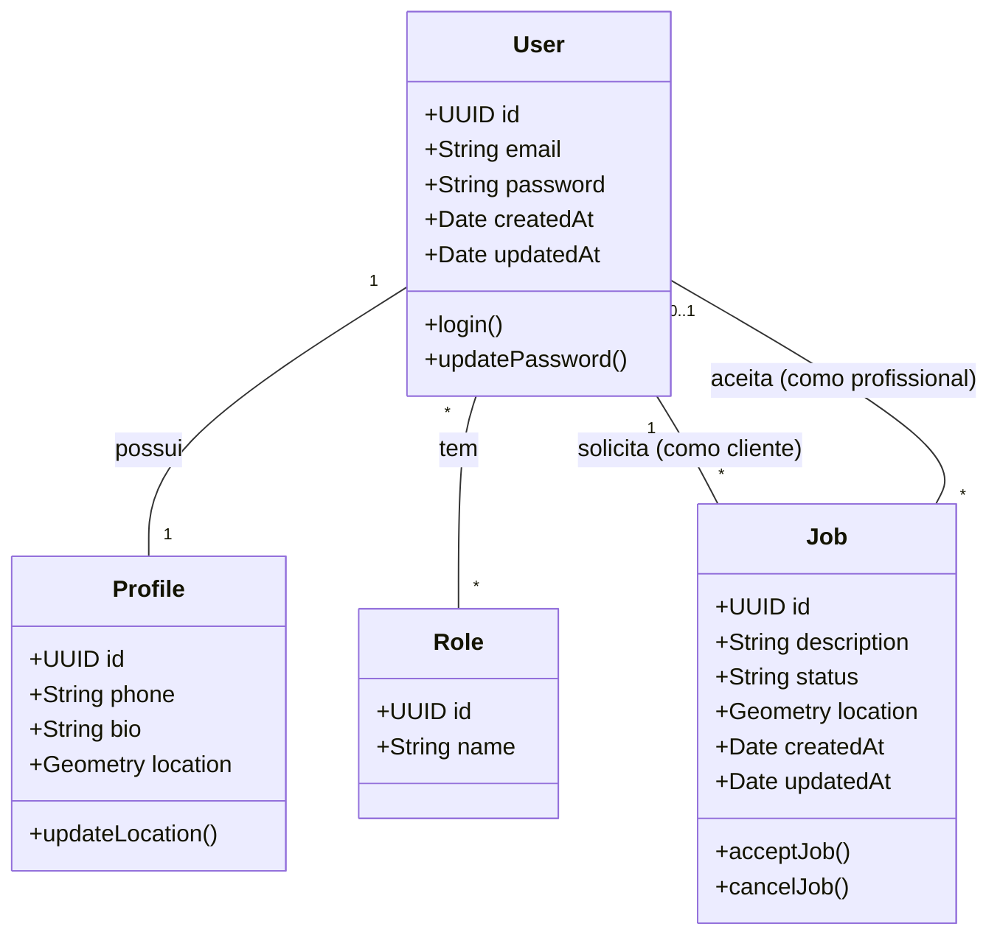
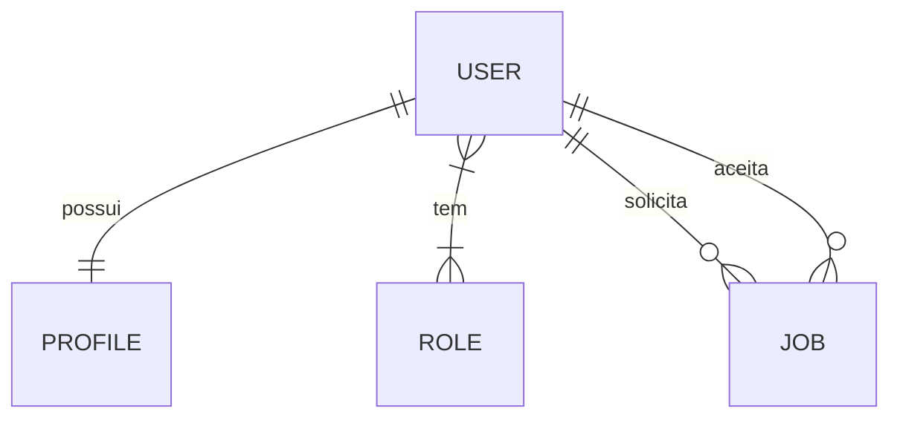

# Documento de Modelos

Neste documento temos o modelo Conceitual (UML) ou de Dados (Entidade-Relacionamento). Temos também a descrição das entidades e o dicionário de dados.

Para a modelagem pode se usar o Astah UML ou o BrModelo. Uma ferramenta interessante para modelos UML é a [YUML](http://yuml.me), no link temos um exemplo de Modelo UML com YUML. Atualmente é possível usar a ferramenta **Mermaid** segundo o blog do GitHub [Include diagrams in your Markdown files with Mermaid](https://github.blog/2022-02-14-include-diagrams-markdown-files-mermaid/). A documentação do **Mermaid** pode ser encontrada em [Mermaid in GitHub](https://mermaid-js.github.io/mermaid).

## Modelo Conceitual

### Diagrama de Classes usando Mermaid

### Descrição das Entidades

Descrição sucinta das entidades presentes no sistema.

| Entidade | Descrição   |
|----------|------------------------------------------------------------------------------------------------------------------------------------------------------|
| User     | Entidade central de autenticação para representar a conta de acesso ao sistema contendo e-mail e senha.                                              |
| Profile  | Entidade que representa os dados públicos (bio, telefone) e a última localização geográfica conhecida do usuário (Extensão da conta do usuário).     |
| Role     | Entidade que representa as permissões de acesso e o papel do usuário na plataforma (USER ou PROFESSIONAL).                                           |
| Job      | Entidade que representa a solicitação de um serviço, armazenando o problema, a coordenada geográfica onde ocorreu e os usuários vinculados.          |

## Modelo de Dados (Entidade-Relacionamento)

Para criar modelos ER é possível usar o BrModelo e gerar uma imagem. Contudo, atualmente é possível criar modelos ER usando a ferramenta **Mermaid**, escrevendo o modelo diretamente em markdown. Acesse a documentação para escrever modelos [ER Diagram Mermaid](https://mermaid-js.github.io/mermaid/#/entityRelationshipDiagram).

### Dicionário de Dados

---

|   Tabela   | users |
| ---------- | ----------- |
| Descrição  | Armazena as credenciais de acesso e informações vitais de autenticação do sistema. |
| Observação | Centraliza o login da plataforma via JWT. |

|  Nome         | Descrição                        | Tipo de Dado | Tamanho | Restrições de Domínio |
| ------------- | -------------------------------- | ------------ | ------- | --------------------- |
| id            | identificador gerado pelo SGBD   | UUID         | ---     | PK / Not Null |
| email         | e-mail do usuário                | VARCHAR      | 255     | Unique / Not Null |
| password      | hash criptografado da senha      | VARCHAR      | 255     | Not Null |
| created_at    | data de criação do registro      | TIMESTAMP    | ---     | Not Null |
| updated_at    | data de atualização do registro  | TIMESTAMP    | ---     | Not Null |

---

|   Tabela   | profiles |
| ---------- | ----------- |
| Descrição  | Armazena as informações públicas do usuário e sua última localização conhecida. |
| Observação | Possui relação 1:1 com a tabela users, separando os dados públicos dos dados sensíveis. |

|  Nome         | Descrição                        | Tipo de Dado   | Tamanho | Restrições de Domínio |
| ------------- | -------------------------------- | -------------- | ------- | --------------------- |
| id            | identificador gerado pelo SGBD   | UUID           | ---     | PK / Not Null |
| user_id       | referência à conta do usuário    | UUID           | ---     | FK / Unique / Not Null |
| phone         | número de telefone de contato    | VARCHAR        | 20      | --- |
| bio           | biografia do profissional/cliente| TEXT           | ---     | --- |
| location      | coordenada geográfica (PostGIS)  | GEOMETRY(Point)| ---     | --- |

---

|   Tabela   | roles |
| ---------- | ----------- |
| Descrição  | Armazena os domínios de permissões de acesso da plataforma. |
| Observação | Os valores padrão no MVP são 'USER' e 'PROFESSIONAL'. |

|  Nome         | Descrição                        | Tipo de Dado | Tamanho | Restrições de Domínio |
| ------------- | -------------------------------- | ------------ | ------- | --------------------- |
| id            | identificador gerado pelo SGBD   | UUID         | ---     | PK / Not Null |
| name          | nome da permissão/papel          | VARCHAR      | 50      | Unique / Not Null |

---

|   Tabela   | jobs |
| ---------- | ----------- |
| Descrição  | Armazena a demanda, sua localização e as partes envolvidas (cliente e profissional). |
| Observação | É o coração do marketplace, sendo consultado massivamente via varredura geográfica (ST_DWithin). |

|  Nome            | Descrição                        | Tipo de Dado   | Tamanho | Restrições de Domínio |
| ---------------- | -------------------------------- | -------------- | ------- | --------------------- |
| id               | identificador do pedido          | UUID           | ---     | PK / Not Null |
| client_id        | usuário que gerou a demanda      | UUID           | ---     | FK / Not Null |
| professional_id  | usuário que aceitou a demanda    | UUID           | ---     | FK / Nullable |
| description      | problema que necessita reparo    | TEXT           | ---     | Not Null |
| status           | estado atual da negociação       | VARCHAR        | 50      | Default: 'SEARCHING' |
| location         | coordenada geográfica (PostGIS)  | GEOMETRY(Point)| ---     | Not Null |
| created_at       | data de criação do pedido        | TIMESTAMP      | ---     | Not Null |
| updated_at       | data de atualização do pedido    | TIMESTAMP      | ---     | Not Null |